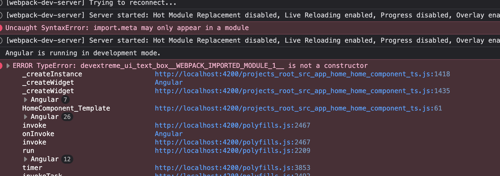

# Angular Module Federation with DevExtreme

This repository demonstrates a **Module Federation** setup using **Angular 19** with **DevExtreme** components. It showcases how to configure and run micro-frontends that share DevExtreme libraries and components between a host and remote application.

## Prerequisites

Before running this project, ensure you have the following installed:

- **Node.js** (version 18.x or higher)
- **npm** (version 9.x or higher)
- **Angular CLI** (version 19.x)

```bash
# Install Angular CLI globally if not already installed
npm install -g @angular/cli@19
```

## Quick Start

### 1. Install Dependencies

```bash
# Clone the repository and navigate to the project folder
git clone <repository-url>
cd mf-and-devex

# Install all dependencies
npm install
```

### 2. Run the Applications

```bash
# Terminal 1 - Start the remote application FIRST
npm run start:remote

# Terminal 2 - Start the host application
npm run start:root
```

### 3. Access the Applications

- **Host Application**: http://localhost:4200
- **Remote Application**: http://localhost:4201

### Installed Dependencies
- **Angular**: ^19.2.0
- **Module Federation**: @angular-architects/module-federation ^19.0.3
- **DevExtreme**: ^24.2.10
- **DevExtreme-Angular**: ^24.2.10
- **TypeScript**: ~5.7.2

### DevExtreme Components Used

**Host Application (Root)**
- `DxTextBoxModule` - Text input components
- `DxButtonModule` - Interactive buttons

**Remote Application**
- `DxDataGridModule` - Data display and manipulation

## Issue faced

When running the root app, in the browser console, we have this error:

```
ERROR TypeError: devextreme_ui_text_box__WEBPACK_IMPORTED_MODULE_1__ is not a constructor
```



This error occurs if we explicitly share the `devextreme/ui/text_box` devex internal package in the module federation configuration [root webpack.config.js](projects/root/webpack.config.js)

If we dont share it (comment out the line), then the error goes away.

Similarly, for remote app, if we share `devextreme/ui/data_grid` in [remote webpack.config.js](projects/remote/webpack.config.js), we get a similar error for DataGrid component. Commenting it out resolves the issue.